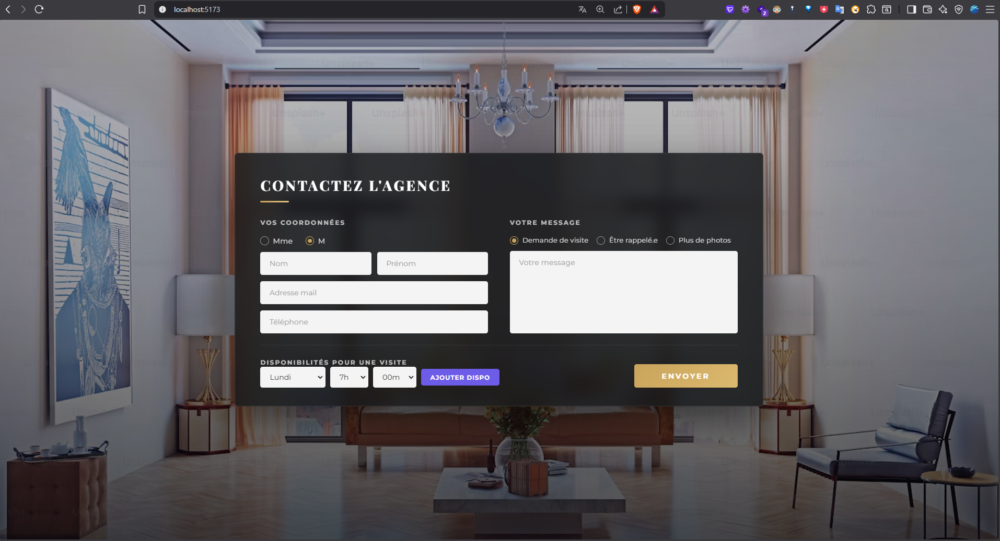
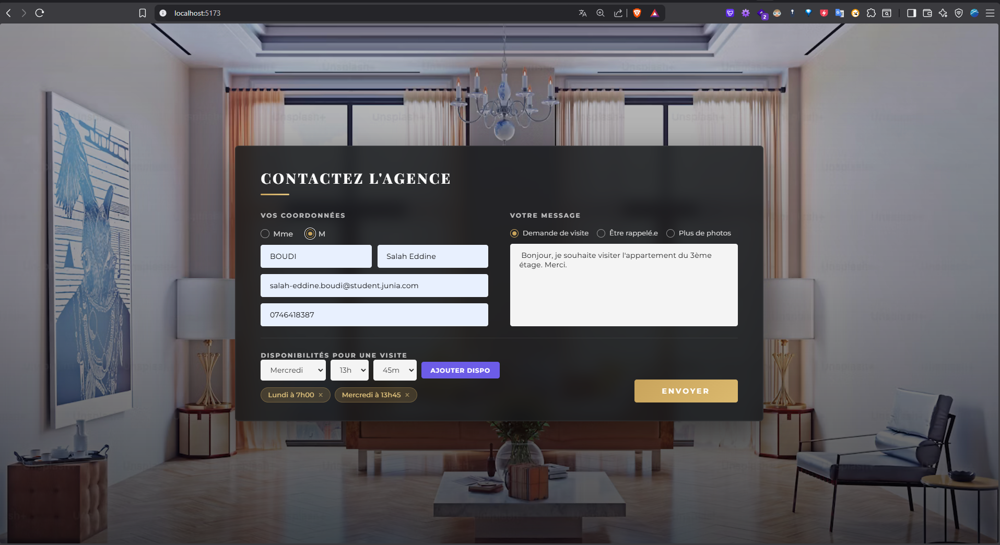
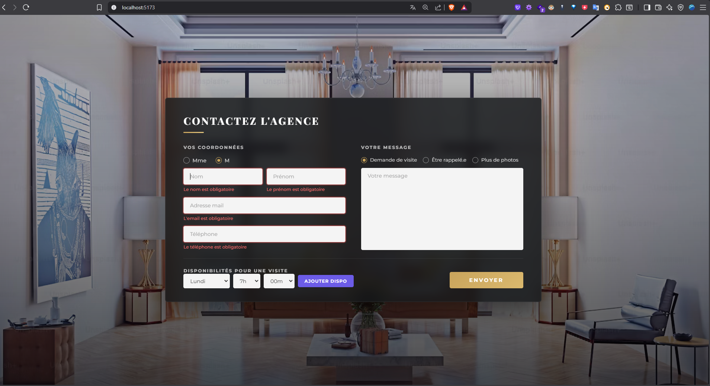
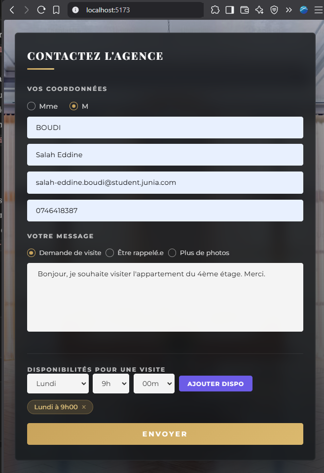

# Test Dev Web Tremplin — Formulaire de Contact Agence Immobilière

## 👤 À propos de moi

| | |
|---|---|
| **Nom / Prénom** | BOUDI Salah Eddine |
| **Formation** | Master 1 — Développement Logiciel et Systèmes d'Information|
| **Stage recherché** | 3 à 4 mois, à partir du 27 avril 2026 |
| **GitHub** | [github.com/Salah-eddine-boudi](https://github.com/Salah-eddine-boudi) |
| **LinkedIn** | [linkedin.com/in/salah-eddine-boudi](https://linkedin.com/in/salah-eddine-boudi) |
| **Email** | salah-eddine.boudi@student.junia.com |

---

## 📸 Screenshots

### Vue principale — Desktop


### Formulaire rempli avec disponibilités


### Validation des champs


### Responsive — Mobile


---

## 🛠 Stack technique & choix

| Outil | Version | Justification |
|-------|---------|---------------|
| **React** | 19.x | Framework front imposé par le test. Vite comme bundler pour un démarrage rapide et un HMR performant. |
| **Vite** | 8.x | Bundler moderne, plus rapide que CRA (déprécié), standard actuel en 2026. |
| **react-hook-form** | 7.x | Gestion de formulaire performante (pas de re-render inutile), validation déclarative intégrée. |
| **react-hot-toast** | 2.x | Notifications légères et élégantes pour le feedback utilisateur (succès/erreur). |
| **Express.js** | 5.x | Serveur backend Node.js minimaliste pour exposer l'API REST. |
| **Prisma ORM** | 5.x | ORM moderne avec migrations automatiques, typage fort et Prisma Studio pour visualiser les données. |
| **SQLite** | — | Base de données fichier, zéro configuration. Le recruteur peut cloner et lancer sans installer de serveur BDD. |
| **Jest + Supertest** | 29.x / 6.x | Tests unitaires backend : validation des endpoints, gestion des erreurs, cas limites. |


### Architecture

test-tremplin/
├── client/                  # React (Vite)
│   └── src/
│       ├── components/      # Composants React (ContactForm, PersonalInfo, etc.)
│       ├── hooks/           # Custom hooks (useAvailability)
│       ├── services/        # Appels API centralisés
│       └── assets/          # Images
├── server/                  # Express.js + Prisma
│   ├── prisma/              # Schéma + migrations
│   └── src/
│       ├── index.js         # Serveur Express + routes API
│       └── tests/       # Tests unitaires
└── README.md

---

## 🚀 Lancement du projet

### Prérequis
- Node.js >= 18
- npm >= 9

### 1. Cloner le projet

```bash
git clone https://github.com/Salah-eddine-boudi/test-tremplin.git
cd test-tremplin
```

### 2. Installer les dépendances

```bash
# Client
cd client
npm install

# Server
cd ../server
npm install
```

### 3. Initialiser la base de données

```bash
cd server
npx prisma migrate dev --name init
```

### 4. Lancer le projet

```bash
# Terminal 1 — Backend (port 3001)
cd server
npm run dev

# Terminal 2 — Frontend (port 5173)
cd client
npm run dev
```

### 5. Ouvrir l'application

- Frontend : [http://localhost:5173](http://localhost:5173)
- API : [http://localhost:3001/api/contacts](http://localhost:3001/api/contacts)
- Prisma Studio : `cd server && npx prisma studio` → [http://localhost:5555](http://localhost:5555)

### 6. Lancer les tests

```bash
cd server
npm test
```

---

## ❓ Questions

### Avez-vous trouvé l'exercice facile ou difficile ? Qu'est-ce qui vous a posé problème ?

L'exercice était d'un niveau intermédiaire. L'intégration de la maquette en elle-même n'a pas posé de difficulté majeure, mais j'ai voulu aller plus loin en proposant un design premium et une architecture propre (séparation client/server, custom hooks, service API centralisé,tests). Le point qui a demandé le plus de réflexion était la gestion des disponibilités : permettre l'ajout/suppression dynamique de créneaux tout en évitant les doublons, puis les persister côté serveur avec une relation one-to-many en base de données.

### Avez-vous appris de nouveaux outils pour répondre à l'exercice ? Si oui, lesquels ?

J'ai approfondi ma maîtrise de **Prisma ORM** (migrations, relations, Prisma Studio) et de **react-hook-form** que j'avais déjà utilisé mais pas avec ce niveau de validation. J'ai également découvert les bonnes pratiques de structuration d'un monorepo client/server avec une architecture de test propre utilisant **Supertest**.

### Quelle est la place du développement web dans votre cursus de formation ?

Le développement web occupe une place centrale dans mon cursus de Master 1 Développement Logiciel à JUNIA ISEN, au sein d'une formation qui couvre l'ensemble du cycle de vie logiciel.

**Développement web full-stack** — Nous travaillons sur des projets avec des technologies professionnelles : React et TypeScript côté frontend, NestJS et Spring Boot côté backend, Laravel pour le développement PHP, ainsi que des bases de données relationnelles (PostgreSQL, MySQL). Les cours couvrent aussi bien les fondamentaux du JavaScript que les frameworks modernes.

*Projet principal cette année React.js/ Nest.js ** — Nous avons développé en équipe de 6 une plateforme communautaire de coaching sur 11 sprints en méthodologie Agile (SCRUM). Le projet couvre tout le cycle d'un produit web professionnel : architecture technique, base de données relationnelle, API REST sécurisées, système d'authentification JWT, messagerie en temps réel, moteur de recommandation, et intégration frontend/backend. Les outils utilisés incluent Git et GitHub pour le versioning et les pull requests, Jira pour la gestion des sprints et le suivi des tâches, Postman pour les tests d'intégration API, Jest pour les tests unitaires, Figma pour le design UI, et Supabase comme base de données cloud PostgreSQL. 

**Testing et QA** — Notre formation intègre les pratiques de tests à tous les niveaux : tests unitaires (Jest, JUnit), tests d'intégration (Postman), et les principes du Quality Assurance pour garantir la fiabilité des livrables.

**DevOps et déploiement** — Nous étudions la conteneurisation avec Docker, l'orchestration avec Kubernetes, les pipelines CI/CD, et les stratégies de déploiement sur des environnements cloud.

**Développement mobile** — Le cursus inclut également le développement d'applications mobiles, nous permettant de concevoir des solutions multiplateformes.

J'ai également consolidé ces compétences à travers mes stages à la SNRT où j'ai développé des applications en production avec React.js, Spring Boot et des API REST sécurisées.

### Avez-vous utilisé un LLM ? Si oui, comment intégrez-vous les LLM à chaque étape de votre workflow ?

Oui , j'utilise les LLM dans mes projets personnels comme outil d'assistance au développement. Concrètement, je m'en sers pour explorer des solutions techniques (comparer des approches d'architecture, choisir entre plusieurs librairies), accélérer l'écriture de code répétitif (boilerplate, configuration), et pour le debugging quand je suis bloqué sur un problème précis. et en phase de review pour identifier des améliorations potentielles. Cependant, je m'assure toujours de comprendre chaque ligne de code produite et je les adapte à mon contexte. Les LLM sont un accélérateur, pas un remplaçant de la réflexion technique.

---

## 📋 Fonctionnalités

- [x] Intégration fidèle de la maquette
- [x] Formulaire réactif avec validation côté client
- [x] Validation côté serveur (email, téléphone, champs requis)
- [x] Gestion dynamique des disponibilités (ajout/suppression/anti-doublon)
- [x] Sauvegarde en base de données (SQLite via Prisma)
- [x] API REST (POST + GET)
- [x] Design responsive (desktop, tablette, mobile)
- [x] Notifications utilisateur (toast succès/erreur)
- [x] Tests unitaires backend (7 cas de test)
- [x] Architecture propre (composants, hooks, services)
- [x] Workflow Git professionnel (branches, PRs, conventional commits)